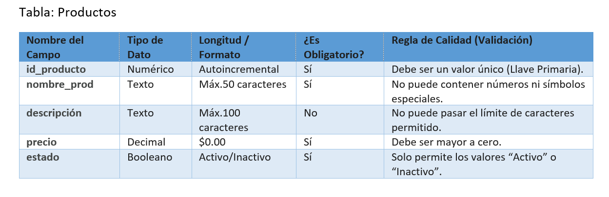

# CONSTRUCCIÓN DEL DICCIONARIO
## 1.Tabla Procutos

# DEFINICIÓN DE ROLES Y FUNCIONES

## 1) ¿Qué rol es el encargado de capturar estos datos?
El Administrador es el encargado de registrar y actualizar los productos del sistema.

---

## 2) ¿Qué función de validación debe realizar el sistema automáticamente?
El sistema debe validar que:

- Los campos que son obligatorios estén completos.
- El precio sea mayor a cero.
- Los nombres de los productos no tengan caracteres inválidos.
- El estado solo permita “Activo” o “Inactivo”.
- No existan productos duplicados.

---

## 3) ¿Qué sucede con la información del sistema si este rol no cumple su función?
La información del sistema puede quedar incorrecta ya que no se ingresan los productos de una forma correcta lo que puede generar errores en el inventario, ventas y reportes del restaurante.
